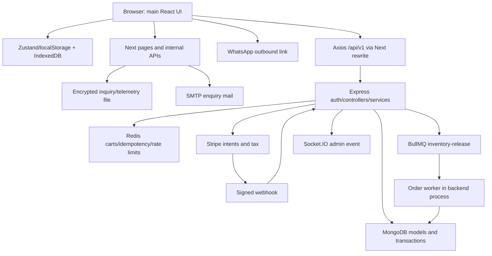

# Architecture

Last reviewed: 2026-09-25. Evidence: local source inspection; runtime/deployment not verified.

## Components and boundaries

| Layer | Implementation | Responsibility |
| --- | --- | --- |
| Main frontend | frontend_appview | App Router; ResponsiveShell; catalogue and B2B lead collection |
| Alternate frontend | frontend_responsive | Independent pastel UI with one homepage; do not merge its theme into main app |
| Frontend state | Zustand, TanStack Query, idb-keyval | Modal/cart state, persisted query cache, browser storage |
| Next server APIs | frontend_appview/src/app/api | SMTP inquiry, geo, telemetry, PIN-admin, Excel export |
| REST backend | backend/src/app.js | Versioned Express routers, middleware and controllers/services |
| Primary ecommerce data | MongoDB / Mongoose | User, Product, Category, Order, Coupon, Review |
| Cache/queue | Redis / ioredis / BullMQ | User/guest carts, idempotency records, rate limits, inventory timeout jobs |
| Analytics/inquiries | src/lib/security/vault.ts | AES-256-GCM encrypted file, separate identity/data store |
| Authentication | JWT cookies/Bearer + separate HMAC admin cookie | Two independent auth systems; not unified RBAC |
| Payments | backend/src/shared/utils/stripe.js | PaymentIntent, tax calculation, webhook signature verification |
| Assets | public folders / Cloudinary | Local images/fonts and signed external uploads |
| Notifications | Nodemailer / Socket.IO / toast | Inquiry email, new_order events, browser feedback |
| Monitoring | Winston, Clarity, custom telemetry | Logging, browser analytics and local portal data |
| Deployment | UNKNOWN | No proven host/CI/backups; documented local scripts only |

## Current B2B flow

Home/occasion/category → select curation / enquiry modal → POST /api/send-inquiry → geo resolve → encrypted vault record → SMTP if configured → response. Missing SMTP configuration can return success without delivery. WhatsApp links provide another outbound contact path.

## Backend ecommerce flow (not current public checkout UI)

Authenticated Redis cart → load active products and server price/variant data → coupon/tax → Mongo transaction decrements inventory and saves pending order; Stripe intent is created within transaction → commit → clear Redis cart → enqueue 15-minute release job → signed webhook confirms/cancels OR worker expires.

MongoDB, Redis and Stripe are not one distributed transaction. Failures after commit, Stripe calls on retries, queue enqueue and webhook/worker races require explicit handling; see EDGE_CASES.

## Route and configuration boundaries

Main Next config proxies /api/v1 to localhost:5001. Proxy page gating uses hardcoded whitelist in appRoutes.config.ts; unmatched API flags default allow. Do not assume toggling a PAGE_ROUTES_CONFIG entry changes effective access. Main root uses ResponsiveShell, not the older MobileShell.

Sources: `frontend_appview/src/app/layout.tsx`, `src/proxy.ts`, `src/config/appRoutes.config.ts`, `next.config.ts`; `backend/src/app.js`, `src/server.js`, `src/features/order`.

## Request and persistence boundaries

This diagram shows implemented paths, not proof of a successful end-to-end purchase. Active curation uses local descriptive IDs; Mongo API requires ObjectIds. Frontend cart payload differs; gated checkout does not confirm clientSecret. Alternate frontend is a separate app, not a server-selected render of main app.

## Redis / BullMQ operational contract

| Use | Key / queue / lifetime | Current behavior / failure |
| --- | --- | --- |
| Guest cart | cart:guest:{sessionId},86400s | Full JSON save resets TTL; missing cart returns items:[] |
| User cart | cart:user:{userId},604800s | Identity from optionalAuth/auth; current local UI not proof of sync |
| Checkout idempotency | idempotency:{clientKey},120s processing/86400s completed | GET+SET (no NX); unscoped response replay; Redis error fails request |
| API rate limit | ratelimit:{ip},60000ms; max100 | GET/SET/INCR;429 when exceeded; Redis errors fail open; disabled in tests |
| Job queue | inventory-release | Shared Redis connection; job name inventory-release-job, data {orderId}, jobId order ID,15min delay |
| Job completion | pending only → restore stock → expired | Worker starts inside server.js unless test; per-item restore errors logged; order still can expire |
| Paid/failed webhook | getJob(orderId), remove | Removal can fail after order status changed; replay pending guard may skip remaining effects |
| Socket adapter | Redis pub/sub clients | Scales broadcasts; join_admins auth missing |

Queue/job code does not configure attempts, backoff, removeOnComplete/removeOnFail, periodic reconciliation, cleanup scheduler or dead-letter handling. Library defaults are not an approved retry/retention policy. Worker has failed-event logging. Server shutdown closes HTTP, worker, Mongo and main Redis connection; separate adapter-client shutdown is not explicit in server.js. Initial worker bootstrap failure is logged; no custom restart supervisor exists in source.

Redis production client disables offline queue, stops reconnect strategy after >3 attempts and uses maxRetriesPerRequest:null; log wording about fallback does not implement a local cache. Test mode tries ioredis-mock. Mongo/Redis/provider failures affect different paths; healthy static UI does not establish backend readiness.

Sources: `backend/src/shared/utils/bullQueue.js`, `backend/src/features/order/order.worker.js`, `backend/src/server.js`, `backend/src/shared/utils/redis.js`, `backend/src/shared/middleware/rateLimiter.middleware.js`.

## B2C target alignment — 2026-09-27

The existing main frontend/Express/Mongo/Redis system is the base for authorized B2C work; current public journey remains unchanged in the first increment. No new schema or infrastructure is required for service-controlled signup roles. Downstream commerce and owner surfaces remain governed by IMPLEMENTATION_PLAN and domain specifications.

## B2C database boundary — 2026-09-28

CURRENT / IMPLEMENTED: B2C/backend/database/{client,models,validators,repositories,transactions,queries,seeds,indexes,tests}. Mongoose is the only application DAL. Dedicated connection and explicit collection names isolate this schema from legacy B2C/backend/src controllers. Root backend and both original frontends were not changed for this database task.

Internal flow: trusted caller → repository/transaction → guarded Mongoose documents → replica-set transaction → MongoDB validators/indexes. Query flow: trusted caller → customer360/ownerDashboard → bounded indexed reads. Future HTTP adapters must authenticate the caller, enforce customer ownership/ADMIN/OWNER roles, build authoritative quotes, verify gateway signatures and reconcile provider outcomes. A browser must never call these internal operations with trusted price/status data. No HTTP routes changed in this increment.

Order snapshots and referenced ledgers preserve history independently of mutable catalogue/customer documents. Customer history uses timestamp/ObjectId cursor pages, not populate of all orders. Owner reporting requires explicit currency/from/to, so different currencies are never added together. Current reports are operational cash/order summaries, not formal accounting or net-profit statements.

## 2026-09-29 — Google auth and Atlas integration

The previously isolated B2C schema now has a real auth adapter in B2C/backend/auth, separate from legacy Express service dependencies. Next auth rewrite -> local auth service -> dedicated Mongoose connection -> users/customers/orders. Google tokens verified server-side; browser session and customer ownership are resolved from MongoDB. Existing catalogue/cart/payment service remains at5002; new auth is5003. Google OAuth state/rate limiting are bounded process-local maps; multi-instance shared state/sticky routing and production deployment hardening remain necessary.

## 2026-10-01 — B2C owner operations

CURRENT / IMPLEMENTED: `/admin` App Router client shell → existing `/api/v1/auth` Next rewrite → Express auth5003 → centralized admin session/RBAC/rate middleware → projected queries or validated commands → explicit Mongoose database. Same browser auth cookie is reused; no additional admin identity store or direct browser database access. Storefront chrome is hidden only on the admin route. Legacy5002 JWT/Stripe workers remain a separate boundary and are not operational dependencies of this portal.

Writes re-authorize and lock the actor, validate expectedVersion/state, invoke existing transaction-safe stock/domain rules, and commit a compact command receipt plus audit atomically. Read pages use stable seek cursors; dashboard requests explicitly select currency/time bounds. Shared Mongo rate records serve multiple app instances; Google redirect state remains process-local. Provider callbacks continue through the existing verified Razorpay flow. Admin cannot force payment confirmation.

CURRENT / PARTIAL: portal reads and supported local commands have isolated integration evidence. Gift preview→saleable catalogue/quote/reservation integration, invoice/refund/carrier/notification automation, queue compatibility, production scale, deployment and live Atlas availability are not established. See ADMIN_FLOWS, API_CONTRACTS and TESTING for exact capabilities and limits.
